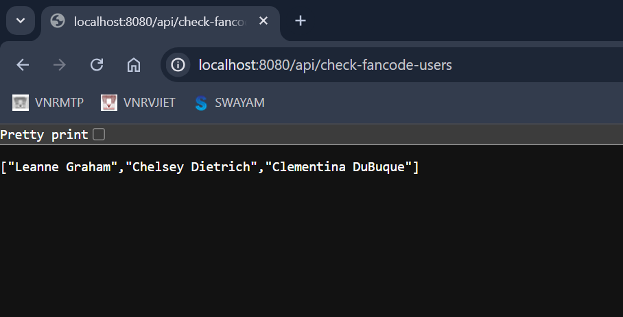

# FanCode-SDET-Assignment
Assignment submission by Bojja Srikar.
## Description
This project checks if users from the city "FanCode" have completed more than half of their todos.

## Setup
1. Clone the repository.
2. Navigate to the project directory.
3. Run the application using `mvn spring-boot:run`.

## Endpoints
- `GET /api/check-fancode-users` - Returns the list of users from "FanCode" who have completed more than half of their todos.

## Testing
- Run tests using `mvn test`.

